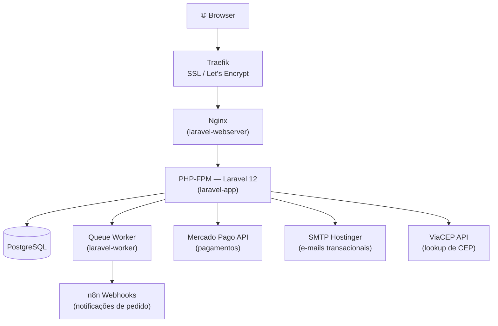

# JFXTech — E-commerce de Hardware Gamer


> Loja online completa para venda de hardware gamer: vitrine pública com catálogo, carrinho autenticado, checkout via Mercado Pago, notificações automáticas via n8n e painel administrativo com analytics, simulador de promoções e gestão completa de produtos e pedidos.

**Docker Hub:** [`felipedaige/jfxtech`](https://hub.docker.com/r/felipedaige/jfxtech)

---

## Visão Geral da Arquitetura



> Três containers Docker compartilham um volume de storage para imagens de produtos. Traefik gerencia SSL automático via Let's Encrypt e roteia o tráfego externo.

---

## Funcionalidades

### Para o Cliente

| Funcionalidade | Descrição |
|---|---|
| Catálogo de produtos | Listagem com filtros por categoria, busca rápida e ordenação |
| Variantes de produto | Tamanho, cor ou qualquer spec — cada variante tem estoque e preço próprios |
| Carrinho autenticado | Adicionar, remover e atualizar quantidades via AJAX sem recarregar a página |
| Favoritos | Salvar produtos para ver depois, persistido por usuário |
| Guest checkout | Compra sem cadastro; conta pode ser criada após o pagamento |
| Cálculo de frete | PAC/SEDEX com tabela de preços por peso (0–10 kg) e região (PR-Londrina, SP, RJ, demais) |
| Lookup de CEP | Preenchimento automático de endereço via ViaCEP |
| Pagamento via Mercado Pago | Cartão de crédito, PIX e demais métodos disponíveis na plataforma |
| Histórico de pedidos | Acompanhamento de status em tempo real e número de rastreio |
| Confirmação de entrega | Cliente confirma recebimento diretamente pelo painel |
| Solicitação de reembolso | Formulário de reembolso integrado ao painel do cliente |
| Cupons de desconto | Aplicar código de desconto percentual no checkout |
| Portal de cupons | Usuários parceiros acompanham desempenho e conversões dos seus cupons |
| Blog | Posts com listagem e página de detalhe |
| Perfil e endereços | CRUD de endereços, edição de dados pessoais e senha |
| Reset de senha | Recuperação por e-mail com link seguro e expiração |

### Para o Admin

| Funcionalidade | Descrição |
|---|---|
| Dashboard com KPIs | Receita total, pedidos, ticket médio, produtos mais vendidos |
| Analytics por produto | Receita líquida, lucro, margem por produto em períodos de 30/90/365 dias |
| Simulador de promoções | Modelar impacto de descontos na receita e margem antes de aplicar |
| Exportação analytics | Relatórios em CSV e PDF gerados diretamente do painel |
| CRUD de produtos | Campos completos: preço, custo, specs JSON, tags, peso, SEO, destaques |
| Gestão de imagens | Upload múltiplo, reordenação por drag-and-drop, substituição individual |
| Variantes e opções | Grupos de opções (ex: "Tamanho"), valores (ex: "P/M/G"), geração automática de variantes |
| Ações em massa | Ativar/desativar/aplicar tags em múltiplos produtos de uma vez |
| Exportação XLSX | Exportar catálogo completo de produtos para planilha |
| CRUD de categorias | Criação e edição com slug auto-gerado |
| Gestão de pedidos | Listagem filtrada, atualização de status, código de rastreio |
| CRUD de cupons | Criar, editar, ativar/desativar e atribuir cupons a usuários parceiros |
| Gestão de usuários | Listagem e atualização de dados (incluindo flag de admin e portal de cupons) |

---

## Stack Tecnológica

| Categoria | Tecnologia | Versão |
|---|---|---|
| Framework backend | [Laravel](https://laravel.com) | 12 |
| Linguagem | PHP | 8.3 |
| Banco de dados | PostgreSQL | — |
| Template engine | Blade | — |
| CSS framework | Tailwind CSS | 4 |
| Build de assets | Vite | 7 |
| JavaScript | Vanilla JS + jQuery | — |
| Gateway de pagamento | Mercado Pago SDK | — |
| Geração de PDF | DomPDF (`barryvdh/laravel-dompdf`) | — |
| Exportação XLSX | Maatwebsite Excel | — |
| Containerização | Docker — PHP-FPM + Nginx + Queue Worker | — |
| Proxy / SSL | Traefik + Let's Encrypt | — |
| Automação | n8n (webhooks de pedido) | — |
| E-mail | SMTP via Hostinger | — |
| CEP | ViaCEP API | — |

---

## Pré-requisitos

- [Docker](https://docs.docker.com/get-docker/) e Docker Compose instalados
- [Node.js](https://nodejs.org/) ≥ 20 no **host** (para build dos assets Vite)
- Git
- PostgreSQL acessível em produção. Para desenvolvimento local, use `docker-compose.local.yml`, que já inclui Postgres.

---

## Instalação e Setup

### Desenvolvimento local rápido

Use este caminho depois de clonar o projeto para abrir a aplicação localmente. O `docker-compose.local.yml` sobe PHP-FPM, Nginx exposto em `localhost:8080`, worker de fila e Postgres local.

```bash
cp .env.example .env
docker compose -f docker-compose.local.yml up -d --build
docker compose -f docker-compose.local.yml exec app php artisan key:generate
docker compose -f docker-compose.local.yml exec app php artisan migrate --force
```

A aplicação estará disponível em `http://localhost:8080`. O compose local sobrescreve as variáveis mínimas de banco para usar o serviço `db`, mas o Laravel continua lendo o `.env` montado no container.

Opcionalmente, popule dados de exemplo após as migrations:

```bash
docker compose -f docker-compose.local.yml exec app php artisan db:seed
```

Para rebuildar os assets frontend no host:

```bash
npm install
npm run build
```

### Produção / VPS

O `docker-compose.yml` principal é voltado para VPS com Traefik externo e banco PostgreSQL já disponível. Ele não expõe porta local diretamente e não inclui serviço de banco.

Antes do deploy, configure secrets fora da imagem Docker: `APP_KEY`, credenciais do banco, Mercado Pago, SMTP e webhooks devem vir do `.env` da VPS ou de um gerenciador de secrets. Não grave secrets em `Dockerfile`, `docker-compose.yml` ou arquivos versionados.

### 1. Clone o repositório

```bash
git clone git@github.com:felipe-daige/jfxtech.git
cd jfxtech
```

### 2. Configure o ambiente

```bash
cp .env.example .env
```

Edite o `.env` e preencha as variáveis obrigatórias (veja a seção [Variáveis de Ambiente](#variáveis-de-ambiente)):

```env
APP_KEY=                          # gerado no passo 5
DB_CONNECTION=pgsql
DB_HOST=                          # host do PostgreSQL
DB_PORT=5432
DB_DATABASE=jfxtech
DB_USERNAME=
DB_PASSWORD=
MAIL_MAILER=smtp
MAIL_PASSWORD=
MERCADO_PAGO_PUBLIC_KEY=
MERCADO_PAGO_ACCESS_TOKEN=
```

### 3. Suba os containers

```bash
docker compose up -d
```

> Para desenvolvimento local, prefira `docker compose -f docker-compose.local.yml up -d --build`.

### 4. Instale as dependências PHP

```bash
docker exec laravel-app composer install --no-dev --optimize-autoloader
```

### 5. Inicialize a aplicação

```bash
docker exec laravel-app php artisan key:generate
docker exec laravel-app php artisan migrate --force
```

Migrations e seeders são etapas pós-build/deploy. Não rode migrations nem seeds dentro do build das imagens Docker.

Em produção, rode seeders somente quando forem explicitamente necessários:

```bash
docker exec laravel-app php artisan db:seed --force
```

### 6. (Opcional em dev/staging) Popule com dados de exemplo

```bash
docker exec laravel-app php artisan db:seed
```

### 7. Crie o symlink de storage

> Feito no **host** — o container não tem permissão para criar symlinks.

```bash
ln -s /var/www/html/storage/app/public /var/www/html/public/storage
chown -R www-data:www-data /var/www/html/storage/app/public/
```

### 8. Build dos assets frontend

```bash
npm install
npm run build
```

A aplicação estará disponível em `http://localhost` (ou no domínio configurado no Traefik).

---

## Setup com Imagens do Docker Hub

As imagens de infraestrutura base estão publicadas em `felipedaige/jfxtech`. Elas contêm o ambiente de runtime (PHP, Nginx, extensões, configurações), mas **não o código da aplicação** — o código é montado via volume.

| Tag | Base | Conteúdo |
|---|---|---|
| `felipedaige/jfxtech:app` | `php:8.3-fpm` | PHP-FPM + extensões (pdo_pgsql, gd, zip, opcache) + configs de produção |
| `felipedaige/jfxtech:webserver` | `nginx:alpine` | Nginx com configuração da aplicação |

```bash
docker pull felipedaige/jfxtech:app
docker pull felipedaige/jfxtech:webserver
```

Para publicar novas versões após alterações na infraestrutura:

```bash
bash docker/build-push.sh          # tag :latest
bash docker/build-push.sh 1.2      # tag de versão específica
```

---

## Variáveis de Ambiente

### Aplicação

| Variável | Descrição | Obrigatória | Default |
|---|---|---|---|
| `APP_NAME` | Nome exibido na aplicação | Não | `Laravel` |
| `APP_ENV` | Ambiente (`local` / `production`) | Sim | `local` |
| `APP_KEY` | Chave de criptografia — gerar com `artisan key:generate` | **Sim** | — |
| `APP_DEBUG` | Modo debug — desligar em produção | Não | `true` |
| `APP_URL` | URL base da aplicação | Sim | `http://localhost` |
| `APP_LOCALE` | Locale padrão | Não | `en` |

### Banco de Dados

| Variável | Descrição | Obrigatória | Default |
|---|---|---|---|
| `DB_CONNECTION` | Driver — usar `pgsql` para PostgreSQL | **Sim** | `sqlite` |
| `DB_HOST` | Host do banco | **Sim** | — |
| `DB_PORT` | Porta | Não | `5432` |
| `DB_DATABASE` | Nome do banco | **Sim** | — |
| `DB_USERNAME` | Usuário | **Sim** | — |
| `DB_PASSWORD` | Senha | **Sim** | — |

### Sessão, Fila e Cache

| Variável | Descrição | Default |
|---|---|---|
| `SESSION_DRIVER` | Driver de sessão | `database` |
| `SESSION_LIFETIME` | Duração da sessão em minutos | `120` |
| `QUEUE_CONNECTION` | Driver da fila de jobs | `database` |
| `CACHE_STORE` | Driver de cache | `database` |

### E-mail

| Variável | Descrição | Obrigatória | Default |
|---|---|---|---|
| `MAIL_MAILER` | Driver — `smtp` em produção, `log` em dev | Sim | `log` |
| `MAIL_HOST` | Servidor SMTP | Sim | `smtp.hostinger.com` |
| `MAIL_PORT` | Porta SMTP | Não | `587` |
| `MAIL_USERNAME` | Usuário SMTP | **Sim** | — |
| `MAIL_PASSWORD` | Senha SMTP | **Sim** | — |
| `MAIL_FROM_ADDRESS` | Endereço de e-mail do remetente | Sim | — |
| `MAIL_FROM_NAME` | Nome do remetente | Não | `JFXTech` |

### Mercado Pago

| Variável | Descrição | Obrigatória |
|---|---|---|
| `MERCADO_PAGO_PUBLIC_KEY` | Chave pública — usada no frontend para tokenização | **Sim** |
| `MERCADO_PAGO_ACCESS_TOKEN` | Token de acesso à API | **Sim** |
| `MERCADO_PAGO_CLIENT_ID` | Client ID OAuth (opcional) | Não |
| `MERCADO_PAGO_CLIENT_SECRET` | Client Secret OAuth (opcional) | Não |
| `MERCADO_PAGO_BASE_URL` | URL base da API | Não |
| `MERCADO_PAGO_WEBHOOK_URL` | URL para receber notificações de pagamento | Sim em produção |
| `MERCADO_PAGO_WEBHOOK_SECRET` | Segredo para validar assinatura do webhook MP | Sim em produção |

### Frete Grátis

| Variável | Descrição | Default |
|---|---|---|
| `FRETE_GRATIS_ATIVO` | Habilitar frete grátis acima de um valor | `false` |
| `FRETE_GRATIS_MINIMO` | Valor mínimo do pedido para frete grátis (em reais) | `0` |

### Notificações n8n

| Variável | Descrição | Default |
|---|---|---|
| `ORDER_STATUS_NOTIFICATION_WEBHOOK` | URL do webhook n8n para receber eventos de pedido | — |
| `ORDER_STATUS_NOTIFICATION_ENABLED` | Habilitar envio de notificações | `true` |
| `ORDER_STATUS_NOTIFICATION_TIMEOUT` | Timeout da requisição em segundos | `5` |
| `ORDER_STATUS_NOTIFICATION_WEBHOOK_AUTH_USER` | Usuário para Basic Auth no webhook | — |
| `ORDER_STATUS_NOTIFICATION_WEBHOOK_AUTH_PASS` | Senha para Basic Auth no webhook | — |

---

## Comandos Úteis

### Docker

```bash
# Subir containers de produção/VPS em background
docker compose up -d

# Subir ambiente local completo
docker compose -f docker-compose.local.yml up -d --build

# Parar containers de produção/VPS
docker compose down

# Parar ambiente local
docker compose -f docker-compose.local.yml down

# Ver logs da aplicação
docker logs -f laravel-app

# Ver logs do worker de filas
docker logs -f laravel-worker

# Reconstruir imagens de produção/VPS localmente
docker compose up -d --build
```

### Artisan (dentro do container)

```bash
# Migrations
docker exec laravel-app php artisan migrate --force
docker exec laravel-app php artisan migrate:fresh --seed

# Cache — sempre rodar após editar views Blade ou configs
docker exec laravel-app php artisan cache:clear
docker exec laravel-app php artisan view:clear
docker exec laravel-app php artisan config:clear
docker exec laravel-app php artisan route:clear

# Fila de jobs
docker exec laravel-app php artisan queue:work
docker exec laravel-app php artisan queue:failed
docker exec laravel-app php artisan queue:retry all

# Testes
docker exec laravel-app php artisan test
docker exec laravel-app php artisan test --filter=NomeDoTeste
docker exec laravel-app php artisan test --verbose
```

### Frontend (no host)

```bash
npm install
npm run build    # build de produção
npm run dev      # watcher com hot-reload para desenvolvimento
```

### Composer (dentro do container)

```bash
docker exec laravel-app composer install
docker exec laravel-app composer install --no-dev --optimize-autoloader
docker exec laravel-app composer dump-autoload
```

---

## Estrutura de Pastas

```
jfxtech/
├── app/
│   ├── Console/Commands/        # FixProdutoImagens, FormatProductDescriptions
│   ├── Enums/                   # PedidoStatus — status do pedido + quais disparam webhook
│   ├── Exports/                 # ProdutosExport (Maatwebsite Excel)
│   ├── Http/
│   │   ├── Controllers/         # 16 controllers (Admin, Site, Carrinho, Pedido, MP, etc.)
│   │   └── Middleware/          # AdminAuth, CaptureCouponCode
│   ├── Jobs/                    # CartAbandonedNotificationJob (delay 30 min)
│   ├── Mail/                    # OrderStatusMail, TemporaryPasswordMail
│   ├── Models/                  # 14 models (Produto, Pedido, User, Cupom, etc.)
│   ├── Observers/               # PedidoObserver — emails + webhooks ao mudar status
│   ├── Services/                # 8 serviços de domínio
│   └── Support/                 # ProdutoDescricaoFormatter
│
├── config/
│   ├── order_status_notifications.php   # Configuração do webhook n8n
│   └── services.php                     # Chaves do Mercado Pago
│
├── database/
│   ├── factories/               # 7 factories (User, Produto, Pedido, Variante, etc.)
│   ├── migrations/              # 45 migrations
│   └── seeders/                 # DatabaseSeeder, CategoriaSeeder, ProductImporterSeeder
│
├── docs/                        # Documentação de features específicas
│
├── public/
│   ├── js/                      # Scripts por página (NÃO processados pelo Vite)
│   │   ├── admin.js             # Admin — modals, bulk actions, reorder imagens
│   │   ├── cart.js              # Carrinho — CRUD sidebar
│   │   ├── checkout-mercadopago.js
│   │   ├── produto-detalhes.js  # Galeria, add-to-cart, variantes
│   │   └── ...                  # (14 arquivos no total)
│   └── storage → storage/app/public   # Symlink para imagens de produtos
│
├── resources/
│   ├── css/app.css              # Tailwind CSS (compilado pelo Vite)
│   ├── js/app.js                # Bootstrap axios (compilado pelo Vite)
│   └── views/
│       ├── admin/               # 17 views do painel administrativo
│       ├── components/          # product-card.blade.php, product-description.blade.php
│       ├── emails/              # 13 templates de e-mail transacional
│       ├── includes/            # header, footer e partials compartilhados
│       └── site/                # 19 views da loja pública
│
├── routes/
│   └── web.php                  # ~60 rotas (site + auth + cart + pedidos + admin + mp)
│
├── tests/
│   ├── Feature/                 # 28 testes de feature
│   └── Unit/                    # 4 testes unitários
│
├── .env.example                 # Template de variáveis de ambiente
├── docker-compose.yml           # Infraestrutura: 3 serviços Docker
├── Dockerfile                   # Imagem PHP-FPM (app + worker)
└── Dockerfile.webserver         # Imagem Nginx
```

---

## Testes

```bash
# Rodar toda a suíte
docker exec laravel-app php artisan test

# Filtrar por nome
docker exec laravel-app php artisan test --filter=CheckoutTest

# Ver detalhes de cada assertion
docker exec laravel-app php artisan test --verbose
```

### Cobertura

| Arquivo de Teste | Área coberta |
|---|---|
| `AdminCupomControllerTest` | CRUD de cupons no admin |
| `AdminDashboardAnalyticsExportTest` | Export CSV e PDF de analytics |
| `AdminDashboardProfitInsightsTest` | Cálculo de lucro e margem no dashboard |
| `AdminOrderDetailsAnalyticsTest` | Analytics por pedido/produto |
| `AdminProductAnalyticsTest` | Analytics de produto individual |
| `AdminProductCrudTest` | CRUD de produtos no admin |
| `AdminPromotionSimulatorTest` | Simulador de promoções |
| `AdminUserManagementTest` | Gestão de usuários |
| `BlogTest` | Listagem e detalhe de posts |
| `CarrinhoVarianteTest` | Carrinho com variantes de produto |
| `CheckoutRecoveryTest` | Recuperação de sessão de checkout |
| `CouponPortalTest` | Portal de cupons do usuário parceiro |
| `CpfPersistenceTest` | Persistência do CPF no fluxo de pedido |
| `CupomCheckoutTest` | Aplicação de cupom no checkout |
| `CupomDashboardTest` | Dashboard de cupons no admin |
| `ErrorPagesTest` | Renderização de páginas de erro |
| `GuestCheckoutTest` | Checkout sem conta e conversão pós-pagamento |
| `MercadoPagoCheckoutTest` | Integração completa com Mercado Pago |
| `OrderEmailNotificationTest` | E-mails de status de pedido |
| `OrderStatusNotificationTest` | Notificações webhook n8n |
| `PasswordResetTest` | Fluxo de reset de senha |
| `PedidoEntregaConfirmationTest` | Confirmação de entrega pelo cliente |
| `PedidoRastreioTest` | Atualização de código de rastreio |
| `PedidoReembolsoTest` | Fluxo de solicitação de reembolso |
| `ProdutoVarianteTest` | Estoque e preço por variante |
| `SitemapTest` | Geração de sitemap XML |
| `TemporaryPasswordLoginTest` | Login com senha temporária gerada pelo admin |
| `PedidoStatusTest` *(unit)* | Lógica do enum de status do pedido |
| `ProdutoDescricaoFormatterTest` *(unit)* | Formatação de descrição de produto |
| `ProdutoVarianteTest` *(unit)* | Regras de negócio de variantes |
